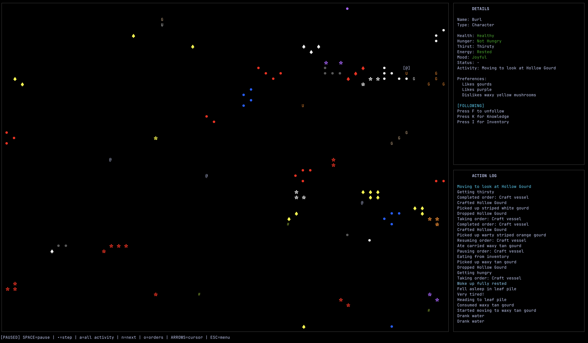

# Petri Project

A simulation game inspired by Dwarf Fortress, to explore the emergent development of culture within a community.

Built with Go and [Bubble Tea](https://github.com/charmbracelet/bubbletea).



## Latest Updates

- **Knowledge system**: Characters learn about poison/healing items through experience
- **Knowledge panel**: Press K to view what a character has learned
- **ESC returns to menu**: ESC now returns to start screen instead of quitting
- **Dynamic preference formation**: Characters form likes/dislikes based on mood when eating or looking at items

## Features

- **Multi-character simulation** with character creation (names, food/color preferences)
- **Multi-stat survival**: hunger, thirst, energy, health, mood with urgency-based AI
- **Knowledge system**: Characters learn about poison/healing through experience
- **Dynamic preferences**: Characters form opinions about items based on attributes
- **Item variety**: Berries, mushrooms (with pattern/texture), and flowers
- **World dynamics**: Item spawning, springs, leaf piles, poison and healing effects
- **View modes**: Select mode (examine entities) and All Activity mode (combined log)

## Running the Game

```bash
go build ./cmd/petri
./petri
```

Or directly:

```bash
go run ./cmd/petri
```

## Controls

**Start Screen:**

- `M` - Start game (opens character creation)

**Character Creation:**

- `← →` - Navigate between characters
- `↑ ↓` / `Tab` - Navigate fields
- `Space` - Cycle option
- `Ctrl+R` - Randomize all
- `Enter` - Start game

**During Game:**

- `Space` - Pause/unpause (world starts paused)
- `.` - Step forward one tick (while paused)
- Arrow keys - Move cursor
- `F` - Follow/unfollow character
- `N` - Cycle to next character
- `K` - Toggle knowledge panel (select mode)
- `A` / `S` - All Activity / Select mode
- `L` - Full log view (complete messages, no truncation)
- `PgUp` / `PgDn` - Scroll action log
- `ESC` - Return to start screen (closes panels first)
- `Q` - Quit

## How It Works

1. Create characters with names and preferences, then start the simulation
2. Characters manage needs (hunger, thirst, energy) prioritized by urgency
3. The world contains edible items (berries, mushrooms), decorative flowers, springs for water, and leaf piles for sleep
4. Characters form preferences based on their mood when interacting with items
5. Mood reflects emotional state, affected by need urgency and preferences

For detailed mechanics, see [docs/game-mechanics.md](docs/game-mechanics.md). For configuration values, see `internal/config/config.go`.

## Debug Mode

```bash
./petri -debug           # Show detailed numeric info
./petri -no-food         # No food items spawned
./petri -no-water        # No springs spawned
./petri -no-beds         # No leaf piles spawned
./petri -mushrooms-only  # Replace all items with mushroom varieties
./petri -help            # Show all available flags
```

Debug mode reveals exact stat values, action progress timers, and poison/healing information.

## Project Vision

See [VISION.txt](docs/VISION.txt) for the full vision statement and development roadmap.
