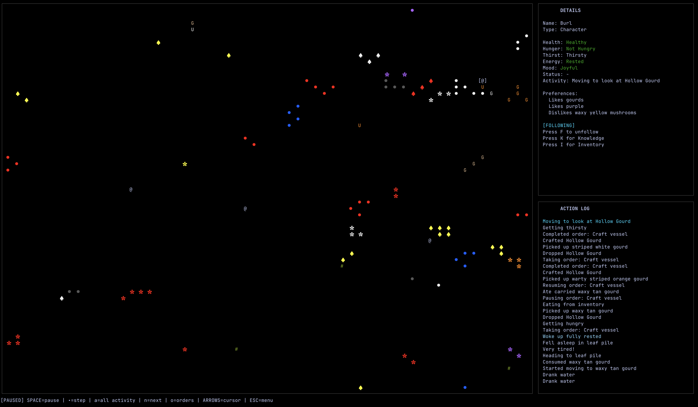

# Petri Project

A simulation game inspired by Dwarf Fortress, with dreams to eventually model emergent development of culture within a community.

Currently, players can observe and interact with characters in a cozy forest world. Watch as they form opinions and try to stay happy while managing their basic survival needs.

Built with Go and [Bubble Tea](https://github.com/charmbracelet/bubbletea).



## Project Vision

Characters don't follow scripts — they will form preferences, learn from experience, share knowledge,
and make decisions based on personality and memory. History exists only in what characters remember and create.
When a character dies, their knowledge dies with them, except what they've taught or built.

See [VISION.txt](docs/VISION.txt) for the full vision and development roadmap.

## Development Process

Petri is built by a product manager and an AI (Claude).
The development process itself is part of the project —
each practice here was designed and iterated on during development.

Core process innovations developed over the course of this project:

- **Skill-driven workflows**: Custom AI skill definitions support iterative development, TDD, human testing checkpoints, and requirement traceability at each step —
  preventing drift with agile spirit
- **Recursive retrospectives**: After each feature, a structured retro reviews collaboration friction, then updates its own skill definitions and design values —
  compounding institutional knowledge across sessions
- **Inferred design values**: Patterns observed during retros are captured as explicit principles that guide future implementation decisions

**See it in action:**

- [`.claude/skills/`](.claude/skills/) — AI interaction protocols developed for this project
- [`docs/Values.md`](docs/Values.md) — design values surfaced through retrospectives
- [`CLAUDE.md`](CLAUDE.md) — codebase context and collaboration norms
- `docs/*-phase-plan.md` — requirement-traced phase plans with TDD checkpoints
- [`docs/VISION.txt`](docs/VISION.txt) — roadmap and long-term direction

## Latest Updates

- **Snacks**: different foods have different satiation levels; characters can eat carried food at mild hunger while working.

### Gardening

- **Gourd Seeds**: Eating a gourd drops a seed on the ground. Seeds are plantable and stack in vessels.
- **Gather Orders**: Players can order characters to gather loose items like sticks, nuts, shells, and seeds from the ground.
- **Fetch Water**: Idle characters can fill a vessel with water to keep with them to drink from while they work.
- **Till Soil**: Players can mark rectangular areas for tilling using an area selection tool. Characters with till know-how procure a hoe and till the marked tiles.
- **Plant Orders**: Players can order characters to plant on tilled soil.
- **Water Garden Orders**: Players can order characters to water planted tiles.
- **Growth Speed Tiers**: Plants grow and spread at different rates, faster when on tilled and/or wet soil.

## How It Works

1. Create characters with names, favorite food, and favorite color, then start the simulation
2. The world contains edible plants, flowers, water sources for drinking, and leaf piles for sleep
3. Characters manage needs (hunger, thirst, energy, health) prioritized by urgency
4. Mood reflects emotional state, affected by need urgency and preferences
5. Characters form preferences based on their mood when interacting with items
6. When idle, characters may look at items, talk with each other, forage, or fill vessels with water.
7. Characters learn from experience, gaining knowledge that affects future behavior
8. Characters gain 'know-how' by making discoveries during item interactions
9. Player can issue orders (harvest, gather, craft, garden) that characters with relevant know-how will complete

For detailed mechanics, see [docs/game-mechanics.md](docs/game-mechanics.md).

## Requirements

- Go version go1.25.5 or higher (https://go.dev/learn/)

## Running the Game

```bash
go build ./cmd/petri
./petri
```

## Controls

**World Selection:**

- `↑ ↓` - Select world
- `Enter` - Continue selected world or start new
- `Q` - Quit

**Character Creation:**

- `← →` - Navigate between characters
- `↑ ↓` / `Tab` - Navigate fields
- `Space` - Cycle option
- `Ctrl+R` - Randomize all
- `Enter` - Start game

**During Game:**

- `Space` - Pause/unpause (saves on pause)
- `.` - Step forward one tick (while paused)
- `<` / `>` - Slow down / speed up (½x, ¼x)
- Arrow keys - Move cursor
- `F` - Follow/unfollow character
- `N` / `B` - Cycle next/previous character
- `E` - Edit character name (select mode)
- `P` - Toggle preferences panel (select mode)
- `I` - Toggle inventory panel (select mode)
- `K` - Toggle knowledge panel (select mode)
- `L` - Return to action log from details subpanel (select mode)
- `O` - Toggle orders panel (+: add, c: cancel, x: expand)
- `A` / `S` - All Activity / Select mode (x: expand to full screen)
- `PgUp` / `PgDn` - Scroll panels
- `ESC` - Go back one level (collapse expanded view → close subpanel → close orders → return to all-activity)
- `Q` - Save and return to world selection

## Debug Mode

```bash
./petri -debug           # Show detailed numeric info
./petri -help            # Show all available flags
```

Debug mode reveals exact stat values, action progress timers, and poison/healing information.

## Save Files

Save data is stored in `~/.petri/worlds/`. Each world has its own directory:

```
~/.petri/
  worlds/
    world-0001/
      state.json      # Current game state
      state.backup    # Previous save (backup)
      meta.json       # World name, character count, last played
    world-0002/
      ...
```

**Managing saves:**

Worlds can be deleted from the title screen by pressing `D` on a saved world (with confirmation).

For advanced management via terminal:

```bash
# List all saved worlds
ls ~/.petri/worlds/

# Delete ALL save data (start fresh)
rm -rf ~/.petri

# Backup your saves
cp -r ~/.petri ~/petri-backup
```

## Customization

**Character Names:** Edit `internal/entity/names.go` to add or remove names from the random name pool.

**Configuration Values:** see `internal/config/config.go`.
