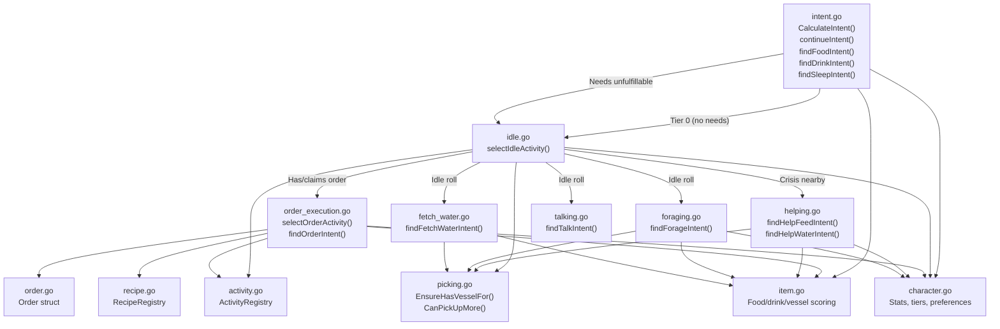
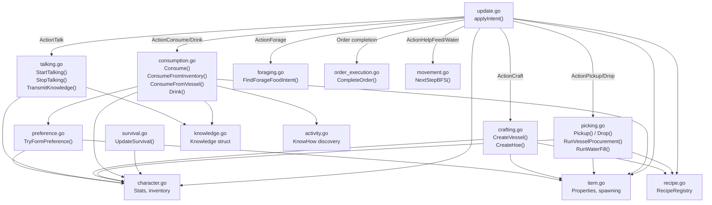
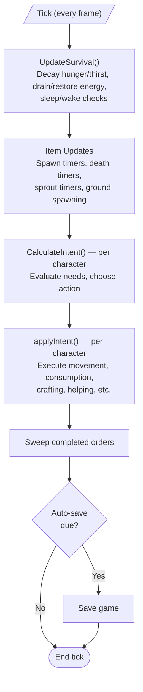
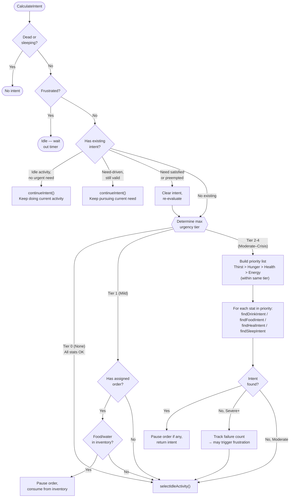
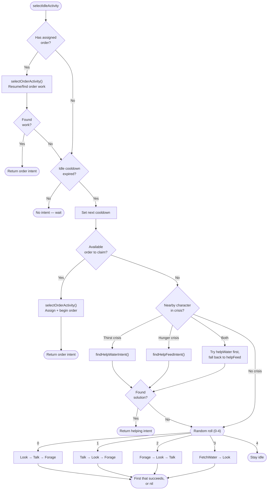
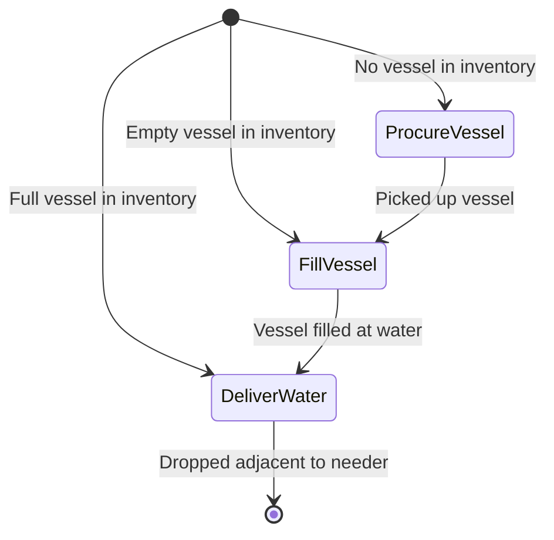
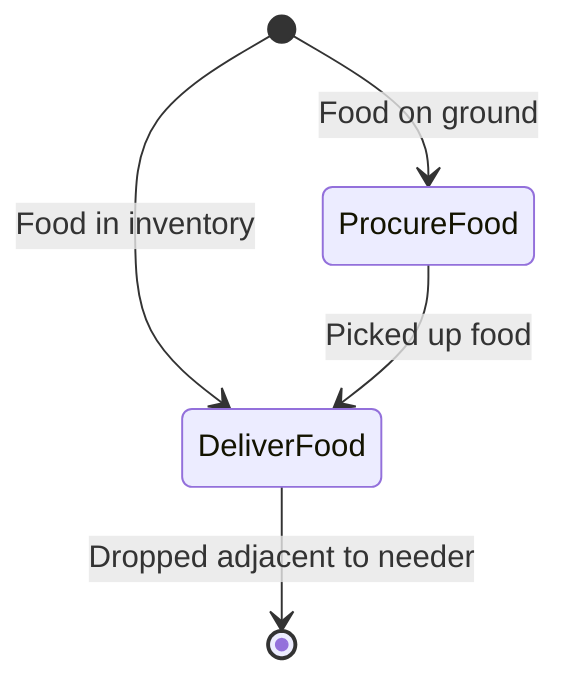
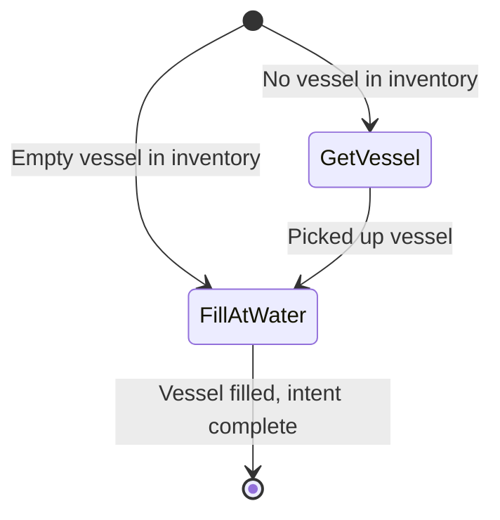
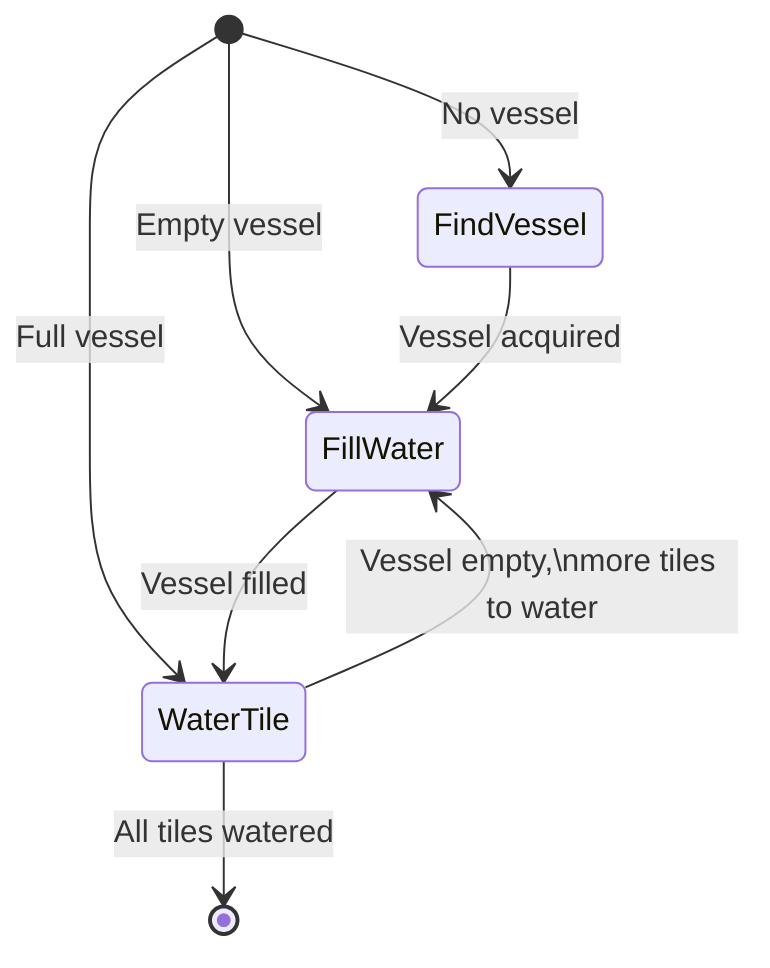

# Petri Flow Diagrams

Visual reference for how character decision-making and game systems connect across the codebase. Ordered from most foundational (structural map) to most specific (individual action state machines).

---

## Architecture: Complete Call Graph

Every cross-file dependency. If the code is spaghetti, this is the spaghetti.

```mermaid
flowchart TD
    subgraph "Game Loop (ui/)"
        update["update.go
        updateGame()
        applyIntent()"]
    end

    subgraph "Decision Layer (system/)"
        intent["intent.go
        CalculateIntent()
        continueIntent()"]
        movement_spatial["movement.go
        NextStepBFS()
        Pathfinding"]
        idle["idle.go
        selectIdleActivity()"]
        orders["order_execution.go
        selectOrderActivity()
        findOrderIntent()"]
        helping["helping.go
        findHelpFeedIntent()
        findHelpWaterIntent()"]
    end

    subgraph "Action Layer (system/)"
        survival["survival.go
        UpdateSurvival()"]
        consume["consumption.go
        Consume/Drink"]
        forage["foraging.go
        findForageIntent()"]
        fetch["fetch_water.go
        findFetchWaterIntent()"]
        pick["picking.go
        Pickup/Drop
        EnsureHas*/RunVessel*"]
        craft["crafting.go
        CreateVessel/CreateHoe"]
        talk["talking.go
        Knowledge transmission"]
        pref["preference.go
        TryFormPreference()"]
    end

    subgraph "Data Layer (entity/)"
        char["character.go
        Stats, tiers, inventory"]
        item["item.go
        Items, properties"]
        activity["activity.go
        ActivityRegistry"]
        order["order.go
        Order struct"]
        recipe["recipe.go
        RecipeRegistry"]
        knowledge["knowledge.go
        Knowledge struct"]
    end

    %% Game Loop → Decision
    update --> intent

    %% Game Loop → Action (execution via applyIntent)
    update --> survival
    update --> consume
    update --> pick
    update --> craft
    update --> talk
    update --> forage
    update --> orders

    %% Game Loop → Data
    update --> char
    update --> item
    update --> recipe

    %% Decision: intent internals
    intent --> movement_spatial
    intent --> idle
    intent --> talk

    %% Decision: intent → Data
    intent --> char
    intent --> item

    %% Decision: idle dispatches
    idle --> orders
    idle --> helping
    idle --> forage
    idle --> fetch
    idle --> talk
    idle --> pick

    %% Decision: idle → Data
    idle --> activity
    idle --> char

    %% Decision: orders dispatches
    orders --> pick
    orders --> craft

    %% Decision: orders → Data
    orders --> activity
    orders --> order
    orders --> item
    orders --> char
    orders --> recipe

    %% Decision: helping
    helping --> pick
    helping --> char
    helping --> item

    %% Action: forage
    forage --> pick
    forage --> item
    forage --> char

    %% Action: fetch
    fetch --> pick
    fetch --> item

    %% Action: consumption
    consume --> char
    consume --> item
    consume --> pref
    consume --> activity
    consume --> knowledge

    %% Action: survival
    survival --> char

    %% Action: picking
    pick --> char
    pick --> item
    pick --> recipe

    %% Action: crafting
    craft --> char
    craft --> item
    craft --> recipe

    %% Action: talking
    talk --> char
    talk --> knowledge

    %% Action: preference
    pref --> char
    pref --> item
```

---

## Architecture: Decision Flow Only

What happens during `CalculateIntent()` — choosing what to do. No action execution.

---

## Architecture: Execution Flow Only

What happens during `applyIntent()` and `UpdateSurvival()` — carrying out decisions.

---

## Main Game Tick Loop

The per-tick processing order in `updateGame()` (`internal/ui/update.go`).

---

## Intent Priority Hierarchy

The core decision tree in `CalculateIntent()` (`internal/system/intent.go`) — what a character decides to do each tick.

---

## Idle Activity Selection

`selectIdleActivity()` (`internal/system/idle.go`) — what happens when a character has no urgent needs.

---

## Multi-Phase Actions

Complex actions that manage internal phase transitions across ticks. Phase is detected from world state each tick (e.g., "is the vessel in my inventory or on the ground?"), not stored explicitly.

### Help Water

### Help Feed

### Fetch Water

### Water Garden

