# Petri Flow Diagrams

Visual reference for how character decision-making and game systems connect across the codebase. Ordered from most foundational (structural map) to most specific (individual action state machines).

---

## Architecture: Complete Call Graph

Every cross-file dependency. If the code is spaghetti, this is the spaghetti.

```mermaid
flowchart TD
    subgraph "Game Loop (ui/)"
        update["update.go
        updateGame()"]
        apply["apply_actions.go
        applyIntent()"]
    end

    subgraph "Decision Layer (system/)"
        intent["intent.go
        CalculateIntent()
        continueIntent()"]
        movement_spatial["movement.go
        NextStepBFS()
        Pathfinding"]
        discretionary["discretionary.go
        selectDiscretionaryActivity()"]
        orders["order_execution.go
        selectOrderActivity()
        findOrderIntent()
        findBuildFenceIntent()
        findBuildHutIntent()
        selectConstructionMaterial()
        findNearestMaterialNotAtSite()"]
        helping["helping.go
        selectHelpingActivity()
        findHelpFeedIntent()
        findHelpWaterIntent()"]
    end

    subgraph "World Layer (game/)"
        worldmap["map.go
        ConstructAt()
        HasUnbuiltConstructionPositions()
        constructionMaterialFeasible()"]
    end

    subgraph "Action Layer (system/)"
        survival["survival.go
        UpdateSurvival()"]
        consume["consumption.go
        Consume/Drink"]
        forage["foraging.go
        findForageIntent()"]
        fetch["fetch_water.go
        findFetchWaterIntent()"]
        pick["picking.go
        Pickup/Drop
        EnsureHas*/RunVessel*"]
        craft["crafting.go
        CreateVessel/CreateHoe"]
        talk["talking.go
        Knowledge transmission"]
        pref["preference.go
        TryFormPreference()"]
    end

    subgraph "Data Layer (entity/)"
        char["character.go
        Stats, tiers, inventory"]
        item["item.go
        Items, properties"]
        activity["activity.go
        ActivityRegistry"]
        order["order.go
        Order struct"]
        recipe["recipe.go
        RecipeRegistry"]
        knowledge["knowledge.go
        Knowledge struct"]
    end

    %% Game Loop → Decision
    update --> intent

    %% Game Loop → Execution
    update --> apply
    update --> survival

    %% Execution (applyIntent) → Action
    apply --> consume
    apply --> pick
    apply --> craft
    apply --> talk
    apply --> forage
    apply --> orders

    %% Execution → Data
    apply --> char
    apply --> item
    apply --> recipe

    %% Decision: intent internals
    intent --> movement_spatial
    intent --> talk

    %% Decision: intent → bucket routing
    intent --> orders
    intent --> helping
    intent --> discretionary

    %% Decision: intent → Data
    intent --> char
    intent --> item

    %% Decision: discretionary dispatches
    discretionary --> forage
    discretionary --> fetch
    discretionary --> talk
    discretionary --> pick

    %% Decision: discretionary → Data
    discretionary --> activity
    discretionary --> char

    %% Decision: orders dispatches
    orders --> pick
    orders --> craft
    orders --> worldmap

    %% Decision: orders → Data
    orders --> activity
    orders --> order
    orders --> item
    orders --> char
    orders --> recipe

    %% Decision: helping
    helping --> pick
    helping --> char
    helping --> item

    %% Action: forage
    forage --> pick
    forage --> item
    forage --> char

    %% Action: fetch
    fetch --> pick
    fetch --> item

    %% Action: consumption
    consume --> char
    consume --> item
    consume --> pref
    consume --> activity
    consume --> knowledge

    %% Action: survival
    survival --> char

    %% Action: picking
    pick --> char
    pick --> item
    pick --> recipe

    %% Action: crafting
    craft --> char
    craft --> item
    craft --> recipe

    %% Action: talking
    talk --> char
    talk --> knowledge

    %% Action: preference
    pref --> char
    pref --> item
```

---

## Architecture: Decision Flow Only

What happens during `CalculateIntent()` — choosing what to do. No action execution.

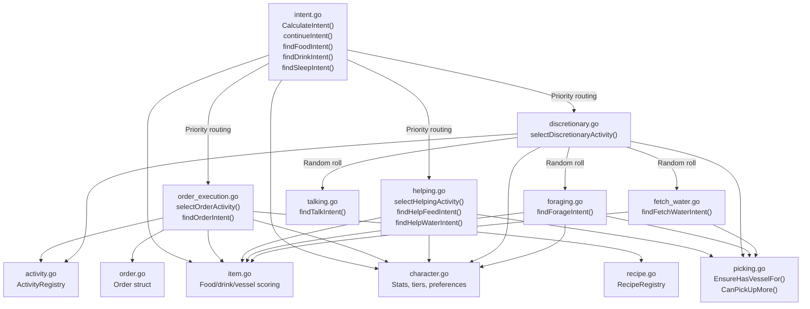

---

## Architecture: Execution Flow Only

What happens during `applyIntent()` and `UpdateSurvival()` — carrying out decisions.

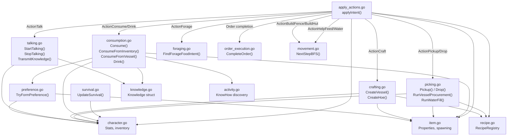

---

## Main Game Tick Loop

The per-tick processing order in `updateGame()` (`internal/ui/update.go`).

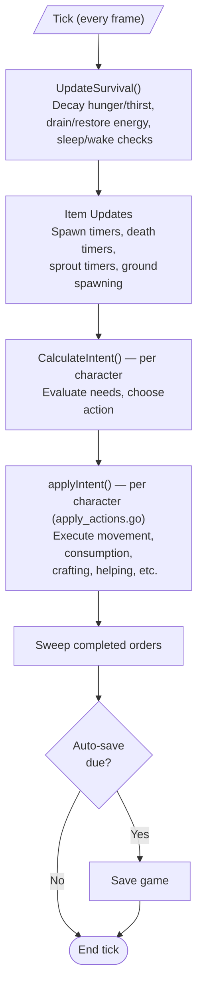

---

## Intent Priority Hierarchy

The core decision tree in `CalculateIntent()` (`internal/system/intent.go`) — what a character decides to do each tick.

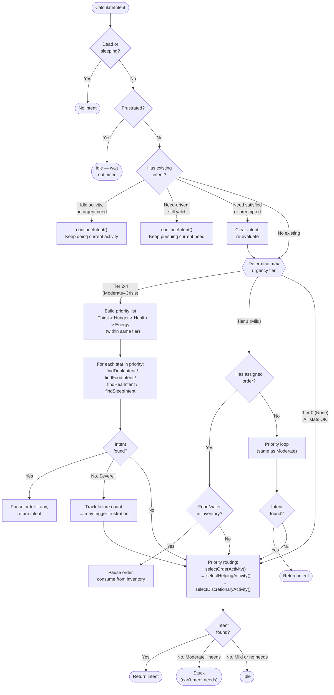

---

## Discretionary Activity Selection

`selectDiscretionaryActivity()` (`internal/system/discretionary.go`) — leisure activities chosen when no needs, orders, or helping are active.

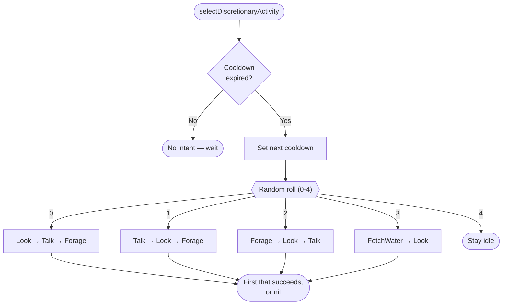

---

## Multi-Phase Actions

Complex actions that manage internal phase transitions across ticks. Phase is detected from world state each tick (e.g., "is the vessel in my inventory or on the ground?"), not stored explicitly.

### Help Water

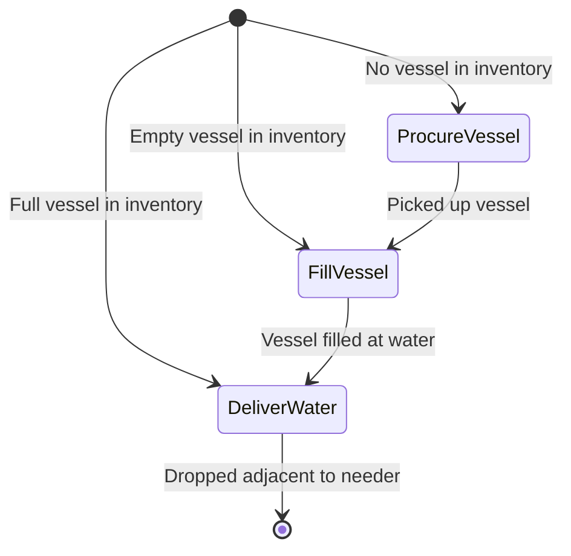

### Help Feed

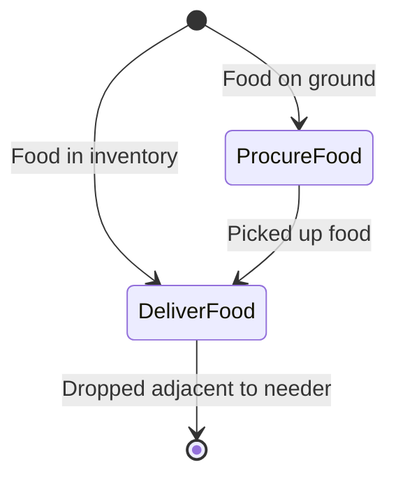

### Fetch Water

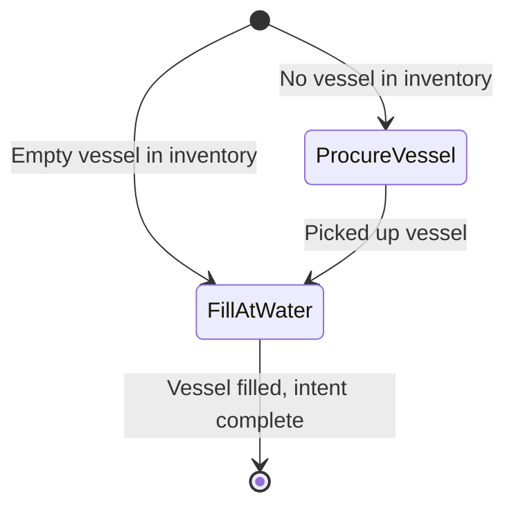

### Water Garden

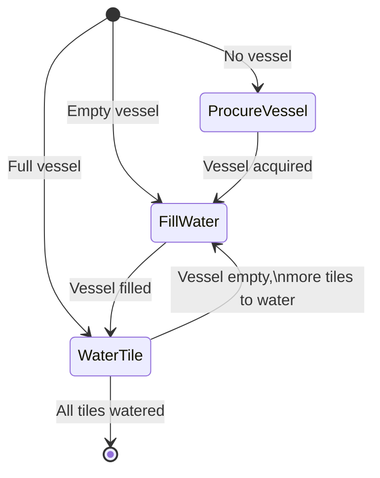

### Construction Order (Fence / Hut)

Same machinery for both. Material is stamped on first tile; subsequent tiles use the same material. Bundles (grass/sticks) can be consumed directly for fences (no supply-drop needed). Bricks and all hut materials use the supply-drop path: carry 2 per trip, deliver, repeat until threshold met, then build.

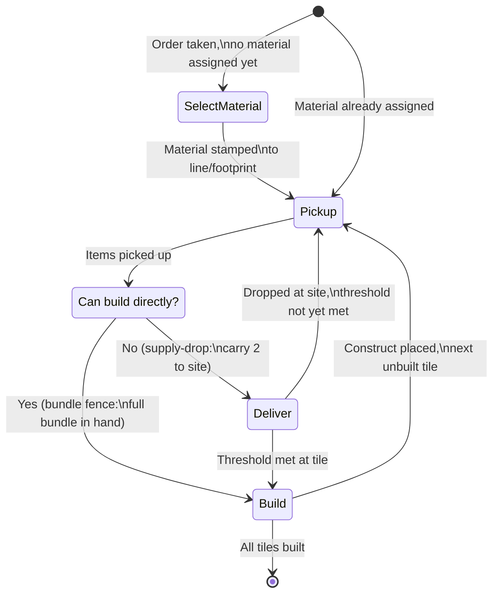

---

## Order Lifecycle

How an order transitions from creation to completion or abandonment.

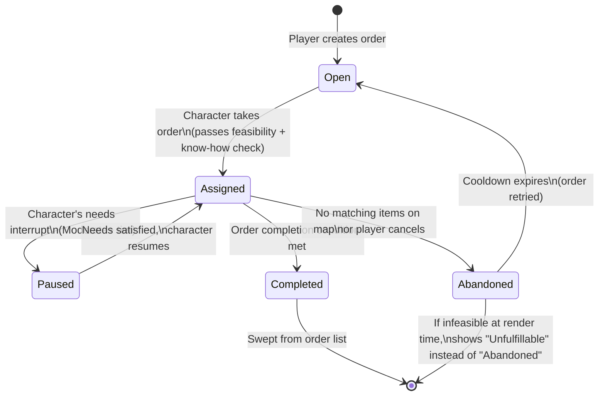

**Feasibility at assignment**: `IsOrderFeasible` is checked before a character takes an open order. Infeasible orders are skipped and shown dimmed. For construction orders, feasibility counts only free (un-staged) materials — items already at construction-marked tiles are excluded.

**Transient nil guard**: For construction orders, when `findBuildHutIntent` returns nil (all candidates temporarily occupied), the guard checks `IsOrderFeasible` — if still feasible, the nil is treated as a transient block and the order is not abandoned.
