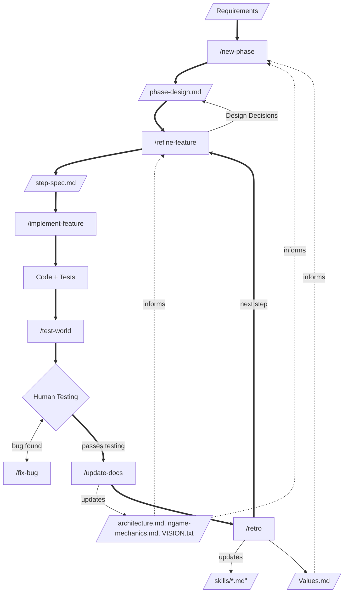

# Process Flow

How skills, documents, and the plan→implement→test→iterate cycle fit together.

## Phase Lifecycle



## Step Rhythm

```
/refine-feature  →  discuss, decide, write step-spec
/implement-feature  →  TDD, build sub-steps
  [TEST]  →  human testing (maybe /test-world)
    → bug? → /fix-bug → retest
  [DOCS]  →  /update-docs
  [RETRO]  →  /retro
→ next step
```

[TEST] → [DOCS] → [RETRO] always appear as a unit at every testable milestone.