# Proposed Decision Flow

How the decision layer would look after extracting intent.go from movement.go. This is the minimal change — just separate the two concerns without reorganizing anything else. Compare with the current decision flow diagram in [flow-diagrams.md](flow-diagrams.md).

```mermaid
flowchart TD
    subgraph "Intent Orchestration (intent.go — NEW)"
        calc["CalculateIntent()
        Urgency tiers, stat priority,
        frustration, option selection"]
        cont["continueIntent()
        Phase detection,
        ongoing intent continuation"]
        fulfill["canFulfill*()
        Feasibility checks"]
        carried["findCarriedDrinkIntent()
        findCarriedFoodIntent()
        Mild-tier inventory checks"]
        food["findFoodIntent()
        FindFoodTarget()"]
        drink["findDrinkIntent()"]
        heal["findHealingIntent()"]
        sleep["findSleepIntent()"]
        look["findLookIntent()"]
        helpers["findNearestItem()
        vesselHasLiquid()
        waterSourceName()
        eatingActivityName()"]
    end

    subgraph "Idle & Social (unchanged)"
        idle["idle.go
        selectIdleActivity()"]
        orders["order_execution.go
        selectOrderActivity()"]
        helping["helping.go
        findHelpFeedIntent()
        findHelpWaterIntent()"]
    end

    subgraph "Domain Evaluators (unchanged)"
        forage["foraging.go
        findForageIntent()"]
        fetch["fetch_water.go
        findFetchWaterIntent()"]
    end

    subgraph "Spatial Engine (movement.go — slimmed)"
        bfs["NextStepBFS()
        nextStepBFSCore()
        NextStep()"]
        adjacent["FindClosestCardinalTile()
        findClosestAdjacentTile()
        isAdjacent()
        isCardinallyAdjacent()"]
    end

    subgraph "Data Layer (entity/)"
        char["character.go"]
        item["item.go"]
        activity["activity.go"]
    end

    %% Intent orchestration calls
    calc -->|"Tier 0"| idle
    calc -->|"Tier 1+ hunger"| food
    calc -->|"Tier 1+ thirst"| drink
    calc -->|"Tier 1+ energy"| sleep
    calc -->|"Tier 1+ health"| heal
    calc --> fulfill
    calc --> carried
    cont --> bfs

    %% Idle dispatches (unchanged)
    idle --> orders
    idle --> helping
    idle --> forage
    idle --> fetch
    idle --> look

    %% Need evaluators use spatial engine
    food --> bfs
    drink --> bfs
    sleep --> bfs
    heal --> bfs

    %% Domain evaluators use spatial engine
    forage --> bfs
    fetch --> bfs
    helping --> bfs

    %% Data reads
    calc --> char
    food --> char
    food --> item
    drink --> item
    idle --> activity
    orders --> activity
```

## What Changes

- **intent.go (new):** Everything that was in movement.go *except* pathfinding and spatial queries. CalculateIntent, continueIntent, all the need-driven evaluators (findFoodIntent, findDrinkIntent, findSleepIntent, findHealingIntent), findLookIntent, fulfillability checks, carried-inventory checks, and small helpers. This is a pure extraction — no logic changes, no merging with other files.
- **movement.go (slimmed):** Only pathfinding (NextStepBFS, nextStepBFSCore, NextStep) and spatial queries (FindClosestCardinalTile, adjacency checks). Pure locomotion.
- **Everything else:** Untouched. foraging.go, fetch_water.go, idle.go, helping.go, order_execution.go all stay exactly as they are.
